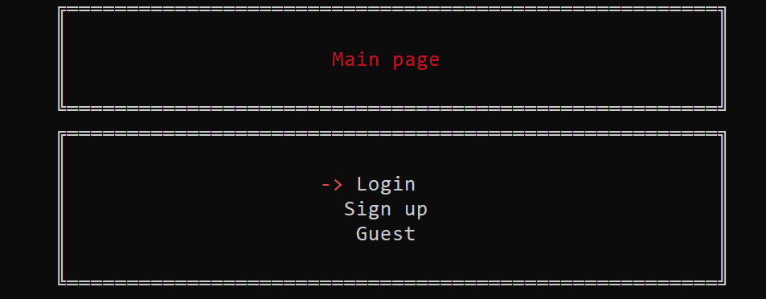
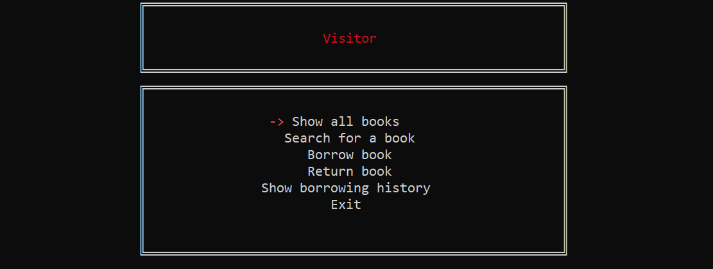

# Library Management System

My first Object-Oriented Programming project in C++.

This project was developed during my **second year at university**, while I was learning Object-Oriented Programming and applying C++ concepts to a complete software system.

The main goal of the project was to build a console-based Library Management System that simulates the basic operations of a real library, while practicing OOP concepts, data management, user roles, and program organization.

---

## Screenshots

<p align="center">
  
  
</p>

---
## About the Project

The Library Management System is a C++ console application designed to simulate the interaction between different types of library users and the library's book database.

The system provides different experiences depending on the user's role:

- **Admin**
- **Visitor / Registered User**
- **Guest**

Users can register, log in, browse books, search for books, borrow and return books, and view their borrowing history.

The project also contains a custom console interface with keyboard-based navigation using the arrow keys.

---

# System Features

## 1. User Management

The system separates users according to their role and permissions.

### Registration

A new user can create an account by providing:

- Username
- Age
- Email
- Password

The system performs input validation before creating the account.

For example:

- Username length validation
- Age validation
- Email format validation
- Password length validation

Each registered user is also assigned a permission level.

### Login

Registered users can log into the system using their account information.

The system then determines what operations the user is allowed to perform based on their role.

### Guest Access

Users can enter the system without creating an account.

Guest users have limited functionality compared with registered users.

---

# 2. User Roles

The system is organized around different types of users.

### Admin

The administrator has access to library management functionality.

The Admin can perform operations related to managing the library's books and users.

### Visitor

A registered visitor can interact with the library as a normal user.

The visitor can:

- View available books
- Search for books
- Borrow books
- Return books
- View borrowing history

### Guest

A guest can access the system without authentication but has restricted permissions.

This demonstrates how the system separates functionality according to user privileges.

---

# 3. Book Management

The library maintains information about books and allows users to interact with them.

The system supports operations such as:

- Viewing books
- Searching for books
- Adding books
- Removing books
- Checking book availability
- Borrowing books
- Returning books

The book information is managed centrally so that different parts of the application can work with the same underlying data.

---

# 4. Borrowing System

Registered users can borrow books from the library.

When a book is borrowed, the system associates the borrowing operation with the corresponding user.

The system can therefore keep track of:

- Which user borrowed the book
- Which book was borrowed
- Whether the book is currently available
- The user's borrowing history

When a book is returned, the system updates the corresponding information and makes the book available again.

---

# 5. Borrowing History

The system keeps track of borrowing operations performed by users.

This allows a visitor to view their previous borrowing activity.

The borrowing history creates a relationship between:

```text
User
  |
  └── Borrowing History
          |
          ├── Book
          └── Borrowing Information
```

This was an important part of the project because the system was not simply storing independent books and users; it was also maintaining relationships between different types of data.

---

# 6. Centralized Data Management

One of the main ideas in the project is having a central `DataBase` object responsible for managing the application's data.

Instead of every screen creating its own independent collection of users and books, the system uses a shared database object.

Conceptually:

```text
                DataBase
                   |
       ┌───────────┼───────────┐
       |           |           |
     Users       Books      History
       |           |           |
       └───────────┼───────────┘
                   |
              Application
```

The database provides operations for working with the stored information, such as:

- Adding users
- Searching for users
- Checking users
- Adding books
- Searching for books
- Checking books
- Deleting books
- Adding borrowing history
- Deleting history

This allows different parts of the application to work with the same underlying data.

For example, when a visitor borrows a book, the operation can update the shared library data rather than creating a separate copy of the books for the Visitor screen.

---

# Technical Features

## Object-Oriented Programming

The project was primarily created to practice Object-Oriented Programming.

The system is divided into different classes representing different responsibilities and entities within the application.

Examples include classes representing:

- Users
- Visitors
- Guests
- Administrators
- Login
- Signup
- Database
- Menus
- Console pages

The project therefore applies concepts such as:

- Classes and Objects
- Encapsulation
- Constructors
- Destructors
- Member Functions
- Structures
- Inheritance
- Function Objects
- Object Composition

---

## STL

The project uses several components from the C++ Standard Library, including:

- `std::vector`
- `std::function`
- `std::string`
- Regular expressions

Vectors are used for storing collections of objects and actions.

---

## Lambda Expressions

Lambda expressions are used to associate menu options with functions.

For example:

```cpp
{
    1,
    "Show all books",
    [this]() {
        V_showallBooks();
    }
}
```

This allowed the menu system to store different operations inside a collection and execute the selected operation dynamically.

---

## Function-Based Menu System

The project contains a custom `SwitchMenu` class.

The menu stores a collection of actions and allows the user to navigate between them using the keyboard.

For example:

```text
       Visitor

   -> Show all books
      Search for a book
      Borrow book
      Return book
      Show borrowing history
      Exit
```

The user can move between options using the arrow keys and execute the selected operation using Enter.

This was an early attempt at creating a reusable UI component rather than implementing a separate keyboard-navigation loop for every screen.

---

## Custom Console UI

The application does not rely only on standard console output.

It contains custom utilities for controlling the Windows console, including:

- Cursor positioning
- Console borders
- Headers
- Page layouts
- Colored text
- Keyboard navigation

The project uses `gotoxy`-style cursor positioning to create a graphical-like interface inside the console.

---

## Input Validation

The application validates user input before accepting it.

Examples include:

- Username length
- Password length
- Age range
- Email format
- Invalid input handling

Regular expressions are used for email validation.

---

# System Analysis Features

In addition to the programming aspects, the project represents an attempt to analyze and model a real-world library system.

## Separation of Responsibilities

Different classes are responsible for different parts of the system.

For example:

```text
User-related classes
        |
        ├── Login
        ├── Signup
        └── User management

Library-related classes
        |
        ├── Book management
        ├── Borrowing
        └── Returning

Data management
        |
        └── DataBase

User Interface
        |
        ├── ConsolePgaes
        └── SwitchMenu
```

This separation was intended to prevent the entire application from becoming one large block of code.

---

## Role-Based Access

The system models different levels of access.

```text
                 Library System
                       |
          ┌────────────┼────────────┐
          |            |            |
        Admin       Visitor       Guest
          |            |            |
       Full          Normal       Limited
      Access         User         Access
```

This reflects a real-world requirement where not every person interacting with a library should have access to the same operations.

---

## Relationships Between Entities

The project models relationships between different entities.

For example:

```text
User
 |
 └── borrows ──> Book
       |
       └── creates ──> Borrowing History
```

A user is therefore not just an isolated object.

The system needs to know how the user interacts with other entities such as books and borrowing records.

---

## State Management

Books have a state that changes depending on user actions.

Conceptually:

```text
Available
    |
    | Borrow
    ↓
Borrowed
    |
    | Return
    ↓
Available
```

This means that an operation such as borrowing a book is not simply a function call; it changes the state of the library.

---

# Project Structure

The project is divided into several directories:

```text
Files/
│
├── Main.cpp
│
├── cpp/
│   ├── Admin.cpp
│   ├── DataBase.cpp
│   ├── Guest.cpp
│   ├── LoginOrSignUpOrGuest.cpp
│   ├── LoginPage.cpp
│   ├── MainPage.cpp
│   ├── SignUpPage.cpp
│   └── Visitor.cpp
│
├── header/
│   ├── DataBase.h
│   ├── LoginOrSignUpOrGuest.h
│   ├── LoginPage.h
│   ├── MainPage.h
│   ├── SignUpPage.h
│   └── Users.h
│
└── lib/    
    ├── currentTime.h
    ├── Design.h
    ├── Design2.h
    ├── gotoxy.h
    ├── SwitchMenu.h
    └── color-console/
        ├──color.hpp
        └──LICENSE.md
```

The `cpp` directory contains the implementations, while the `header` directory contains class declarations and data structures.

The `lib` directory contains reusable utilities used by the application, such as console design, cursor positioning, menu navigation, and color handling.

---

# Technologies

- C++
- Object-Oriented Programming
- C++ Standard Library (STL)
- `std::vector`
- `std::function`
- Lambda Expressions
- Regular Expressions
- Windows Console API
- Console-based UI

---

# Development Context

This project was developed during my **second year at university**, while I was studying Object-Oriented Programming and learning how to design larger C++ applications.

At that stage, the primary objective was not to create production-level software, but to understand how the concepts I was learning could be combined to create a complete system.

The project therefore represents an important stage in my learning journey from writing individual programs to designing applications consisting of multiple interacting classes and components.

---

## Status

**Archived / Educational Project**

This project is preserved primarily for historical and educational purposes.
